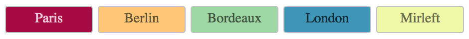

# color-seed

[![npm package][npm-badge]][npm]

Stable colors generator from given seed(s).

Based on [seedrandom](https://github.com/davidbau/seedrandom), [chroma-js](http://gka.github.io/chroma.js) Spectral scale.



## Install

`npm install color-seed`

## Usage

```js
import color from "color-seed";

const parisColor = color.getColor('paris');
// always return #a70b44
```

demo : https://codesandbox.io/s/jzqn0m1z03

## Tests
```
  colorSeed
    colorSeed.getColor : single seed
      ✓ getColor("Paris") should return #a70b44
      ✓ getColor("Marseille") should return #7acaa5
      ✓ getColor("Bordeaux") should return #9ed8a4
    colorSeed.getColors : multiple seed
      ✓ getColors(["Paris", "Marseille", "Bordeaux"]) should return #a70b44, #7acaa5, #9ed8a4
      ✓ getColors(["Paris", "Marseille", "Bordeaux", "xxx"]) should return #a70b44, #7acaa5, #9ed8a4, #3683bb

  5 passing (13ms)

```

[npm-badge]: https://img.shields.io/npm/v/color-seed.png?style=flat-square
[npm]: https://www.npmjs.org/package/color-seed
